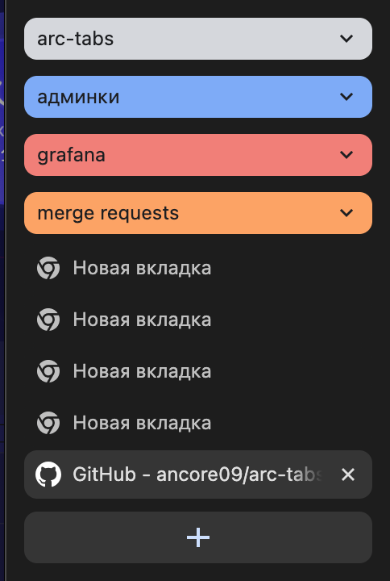
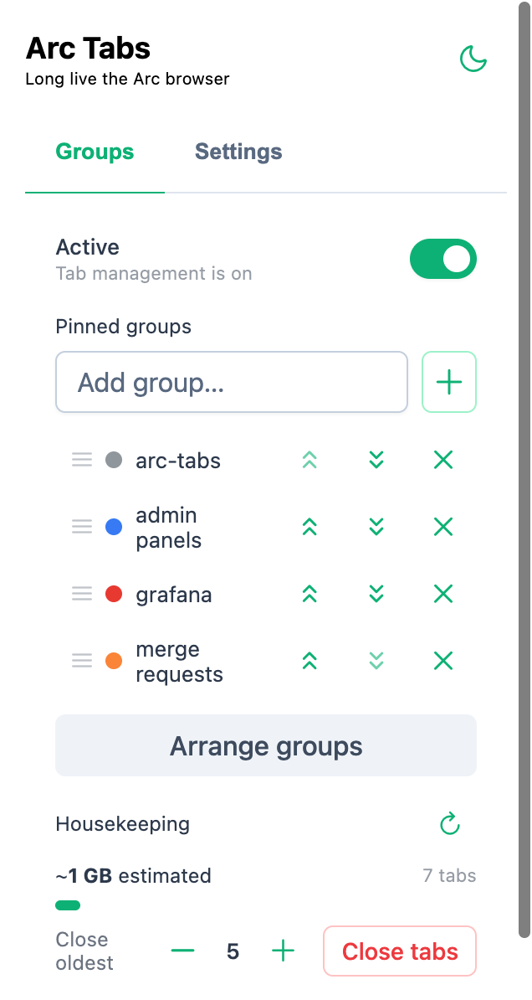
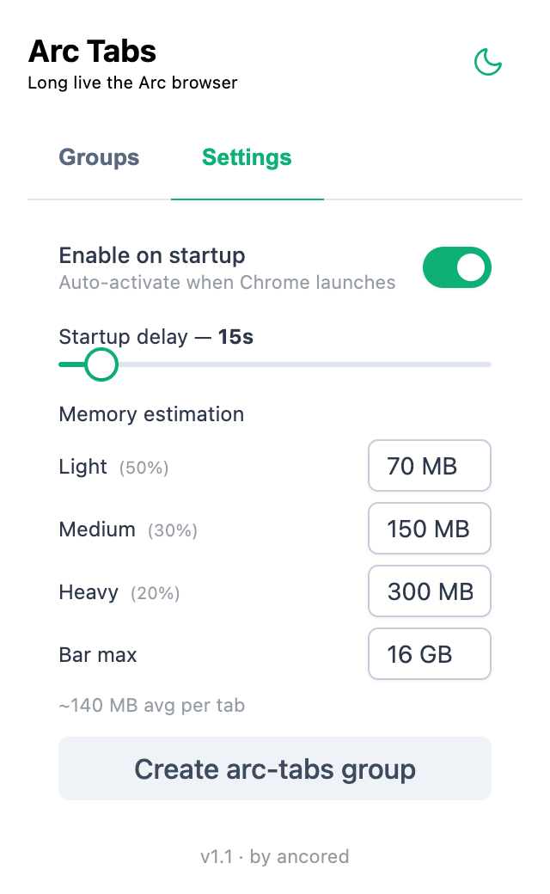

# arc-tabs

Расширение имитирует поведение Arc Browser в отношении открытия новых вкладок в Google Chrome.

### Аналогия с Arc

Для начала немного терминологии:
- **Постоянные вкладки** — закрепленные вкладки в Arc. В рамках этого расширения в Chrome закрепленными считаются группы вкладок, которые находятся в самом начале панели вкладок.
- **Временные вкладки** — вкладки в Arc, которые находятся под закреплёнными (они автоматически архивируются Arc'ом). В рамках этого расширения временными считаются все вкладки правее «закреплённых» групп.

Пример:



Здесь постоянными вкладками считаются вкладки внутри групп arc-tabs, админки, grafana, merge requests. Временными — все остальные.

### Что умеет расширение

- **Позиционирование новых вкладок.** При открытии новой вкладки она перемещается на позицию сразу после последней закреплённой группы — точно как в Arc. При этом происходит автоматический скролл панели вкладок к новой вкладке.
- **Задержка при старте.** Чтобы вкладки не перемещались во время восстановления предыдущей сессии, расширение на настраиваемый интервал отключается сразу после запуска Chrome. Пока задержка активна, в попапе отображается обратный отсчёт.
- **Ручное управление активностью.** Расширение можно включать и выключать прямо из попапа. Кнопка «Active» немедленно меняет состояние; нажатие во время обратного отсчёта пропускает оставшееся время задержки.
- **Упорядочивание закреплённых групп.** Можно указать, какие группы считать закреплёнными, задать их порядок перетаскиванием и восстановить нужный порядок кнопкой «Arrange groups».
- **Хаускипинг.** Отображает количество открытых вкладок и приблизительный объём занимаемой памяти. Позволяет одним нажатием закрыть N самых старых вкладок (с наибольшим индексом — те, что открыты давно и находятся внизу в панели).

### Установка

1. Настроить браузер:
    - В `chrome://flags/` включить `vertical-tabs`
    - В `chrome://flags/` выключить `new-tab-adds-to-active-group`
2. В `chrome://extensions/` активировать режим разработчика.
3. Склонировать репозиторий.
4. Собрать расширение:
    ```bash
    npm install
    npm run build
    ```
5. В `chrome://extensions/` загрузить собранное расширение, указав папку `.output/chrome-mv3`.

### Использование

Расширение начинает работать сразу после установки. UI разбит на две вкладки.

#### Вкладка «Groups»

 

- **Active** — включает/выключает расширение. Пока активна задержка запуска, отображается обратный отсчёт («Starting in 12s…»). Клик по тогглу немедленно активирует расширение, пропуская оставшееся время.
- **Pinned groups** — список групп вкладок, которые считаются закреплёнными. Группы можно добавлять, удалять и сортировать перетаскиванием или кнопками ↑↓. Только эти группы участвуют в расчёте позиции новой вкладки.
- **Arrange groups** — перемещает закреплённые группы в начало панели вкладок в указанном порядке. Полезно, если порядок нарушился.
- **Housekeeping** — показывает количество открытых вкладок и приблизительный объём памяти (оценка на основе статистического распределения). Кнопка «Close tabs» закрывает N самых старых вкладок (не закреплённых); количество регулируется кнопками «−» / «+».

#### Вкладка «Settings»



- **Enable on startup** — если включено, расширение автоматически активируется при каждом запуске Chrome (с учётом задержки). Если выключено — после запуска браузера расширение остаётся неактивным до ручного включения.
- **Startup delay** — слайдер от 10 до 60 секунд. Задаёт, как долго расширение не будет перемещать вкладки после старта браузера.
- **Create arc-tabs group** — создаёт группу с пустой вкладкой, которая используется для хака скролла панели. Рекомендуется держать её первой среди закреплённых групп. Если группа удалена — расширение пересоздаёт её автоматически.
- **Memory estimation** — настройка формулы оценки памяти. Задаёт предполагаемый объём для трёх категорий вкладок (лёгкие 50% / средние 30% / тяжёлые 20%) и масштаб шкалы («Bar max»). Все значения сохраняются локально.

### Технические детали

#### Скролл к новой открытой вкладке

В Chrome нет встроенного API для управления скроллом панели вкладок. Поэтому используется грязный хак: при открытии новой вкладки фокус перемещается на самую первую вкладку (триггерит скролл наверх), после чего фокус возвращается на новую вкладку. Чтобы сгладить моргание, рекомендуется создать группу `arc-tabs` с пустой вкладкой — она будет использоваться в качестве промежуточного фокуса, и моргание практически не заметно.

При наличии группы с названием `arc-tabs` расширение отслеживает её, перемещает в начало и пересоздаёт при удалении.

#### Оценка памяти

Точные данные о памяти, занятой Chrome, недоступны в стабильных версиях браузера (API `chrome.processes` работает только в Dev/Canary-каналах). Поэтому используется статистическая оценка: каждой вкладке приписывается средний объём памяти на основе заданного распределения (по умолчанию: 50% вкладок × 70 МБ + 30% × 150 МБ + 20% × 300 МБ ≈ 140 МБ/вкладка). Формулу можно настроить в настройках расширения.
